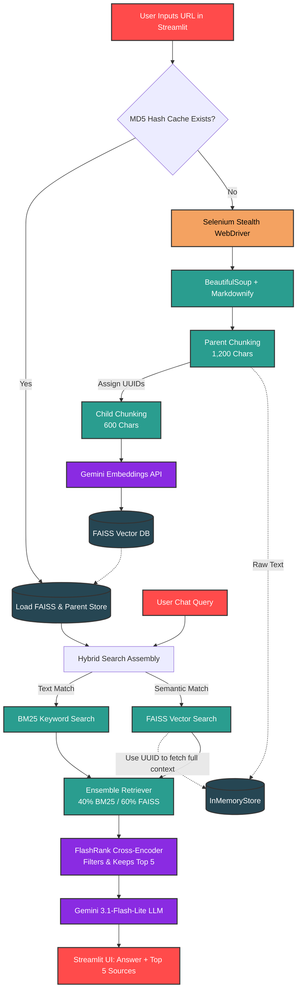

# 🕸️ RAG-CRAW: Enterprise-Grade Web Scraping & RAG Pipeline


** Live Demo:** [https://src-rag-craw.streamlit.app/](https://src-rag-craw.streamlit.app/)

RAG-CRAW is an advanced Retrieval-Augmented Generation (RAG) system built to dynamically ingest web pages, process them through a sophisticated NLP pipeline, and generate highly accurate, hallucination-free answers using Google's Gemini LLM.

Unlike standard RAG tutorials, this project implements **Enterprise-grade architectures**, including Hierarchical Parent-Child Chunking, Hybrid Search (FAISS + BM25), Cross-Encoder Re-ranking (FlashRank), and Persistent Vector Caching.

---

## Key Enterprise Features

* **Stealth Web Scraping:** Uses headless Selenium (`Firefox-ESR`) with a dynamically injected Windows 10 Chrome Desktop `User-Agent` to bypass standard anti-bot firewalls (like Cloudflare) and extract raw HTML after JavaScript execution.
* **Hierarchical (Parent-Child) Chunking:** Embeds small chunks (600 characters) for pinpoint vector math, but retrieves large parent chunks (1,200 characters) to ensure the LLM has complete context and doesn't suffer from "lost-in-the-middle" amnesia.
* **Hybrid Search (Ensemble Retriever):** Fuses **FAISS** semantic similarity search (60% weight) with **BM25** exact-keyword matching (40% weight) to handle both contextual queries and dense jargon/acronyms.
* **Cross-Encoder Re-ranking (FlashRank):** Passes retrieved chunks through a local `ms-marco-MultiBERT` model to mercilessly grade and filter out irrelevant context before it ever reaches the LLM.
* **Persistent Vector Caching & Garbage Collection:** Hashes the URL to locally save the FAISS `.faiss` index and `.pkl` document store. Skips the scraping and embedding pipeline entirely on subsequent visits. A garbage collector safely limits the cache to the 5 most recent sites.
* **API Rate-Limit Defenses:** Custom exponential backoff and dynamic batching (90 chunks/batch) prevent Google API `429 Too Many Requests` crashes during heavy ingestion.

---

## System Architecture & Workflow

The following flowchart illustrates the complete data lifecycle, from URL ingestion to final UI generation.

*(Note: GitHub natively renders this Mermaid.js diagram.)*



---

## Technical Deep Dive: Major Hurdles

One of the major engineering hurdles in this project was balancing chunk sizes with the Cross-Encoder re-ranker.

Initially, Parent Chunks were set to `2,000` characters. While this provided great context, **RAGAS evaluation metrics showed a massive drop in Context Precision**.

* **The Diagnosis:** The FlashRank BERT-based model operates on a strict **512-token limit** (~2,048 characters). By feeding it a 2,000-character chunk alongside a user query, it exceeded the memory limit, causing the model to forcefully truncate the bottom half of the text. If the answer lived in the truncated half, the chunk was discarded.
* **The Fix:** Parent chunk sizes were aggressively tuned down to `1,200` characters (~300 tokens), leaving a safe 200+ token buffer for system prompts and user queries.
* **The Result:** FlashRank successfully reads 100% of the retrieved text. RAGAS **Faithfulness surged to 0.90** and **Answer Relevancy doubled to 0.72**.

---

## Tech Stack

* **Frontend Interface:** `Streamlit` (with state management & custom CSS injection)
* **Web Scraping & Parsing:** `Selenium`, `BeautifulSoup4`, `Markdownify`
* **Orchestration & Chunking:** `LangChain` (v0.2.x), `RecursiveCharacterTextSplitter`, `MarkdownHeaderTextSplitter`
* **Embedding & LLM:** Google `gemini-embedding-2`, Google `gemini-3.1-flash-lite`
* **Vector Database & Storage:** `FAISS-cpu`, LangChain `InMemoryStore`
* **Search Algorithms:** `rank_bm25` (BM25), `FlashRank` (MultiBERT Cross-Encoder)

---

## Live Demo

Try the app instantly without any local setup:

👉 **[https://src-rag-craw.streamlit.app/](https://src-rag-craw.streamlit.app/)**

---

## Installation & Local Setup

### 1. Clone the repository

```bash
git clone https://github.com/soumyadeep-rc/RAG-CRAW.git
cd RAG-CRAW
```

### 2. Create a Virtual Environment (Optional but Recommended)

```bash
python -m venv venv
source venv/bin/activate  # On Windows use: venv\Scripts\activate
```

### 3. Install Dependencies

```bash
pip install -r requirements.txt
```

*(Note: Streamlit Cloud deployments require a `packages.txt` file containing `firefox-esr` to run the headless web scraper).*

### 4. Setup Environment Variables

Create a `.env` file in the root directory and add your Google API key:

```env
GOOGLE_API_KEY="your_api_key_here"
```

### 5. Run the Application

```bash
streamlit run client.py
```

---

## Evaluation & Metrics (RAGAS)

The pipeline was benchmarked using the **RAGAS framework** to optimize hyperparameters. The current setup intentionally sacrifices strict Context Precision (by increasing `top_n=5` candidates) in order to maximize **Recall**, ensuring the LLM is fed enough context to achieve near-perfect **Faithfulness (0.90)** and hallucination-free generation.

---

## License

Distributed under the [MIT LICENSE](https://github.com/soumyadeep-rc/RAG-CRAW/blob/main/LICENSE)

---

## Contributing

Contributions, issues, and feature requests are welcome!
